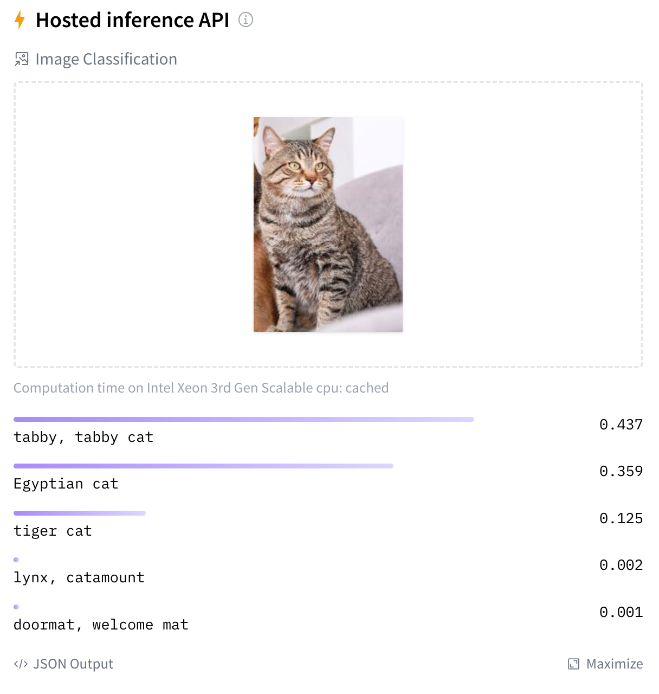
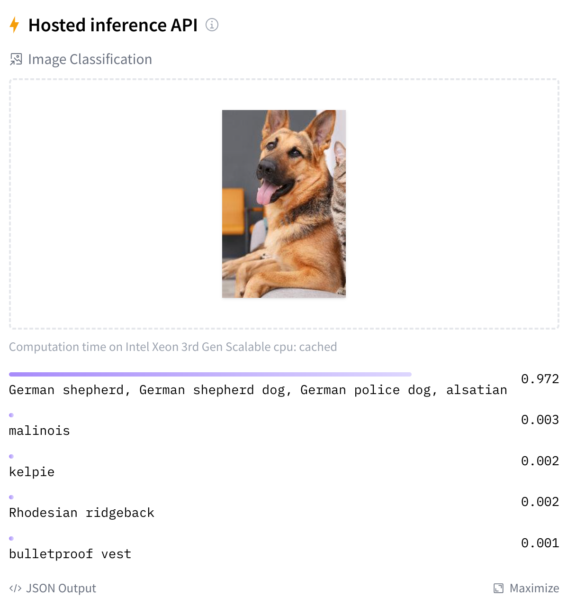

# YB-Instance-Segmentation 🐶🐱
 >  **임베디드 기기를 활용한 빠른 이미지 분류**

- 각종 모델 검증 및 테스트
- 하드웨어 별 동작 시간 비교
- 데모 제작

 
 

## 설명
| **사용언어** | **하드웨어** | **제작년도** |
|:------------:|:------------:|:------------:|
| Python            | NVIDIA Jetson series / Firefly RK series    | 2023         |

 
 

### 데모

 
 
